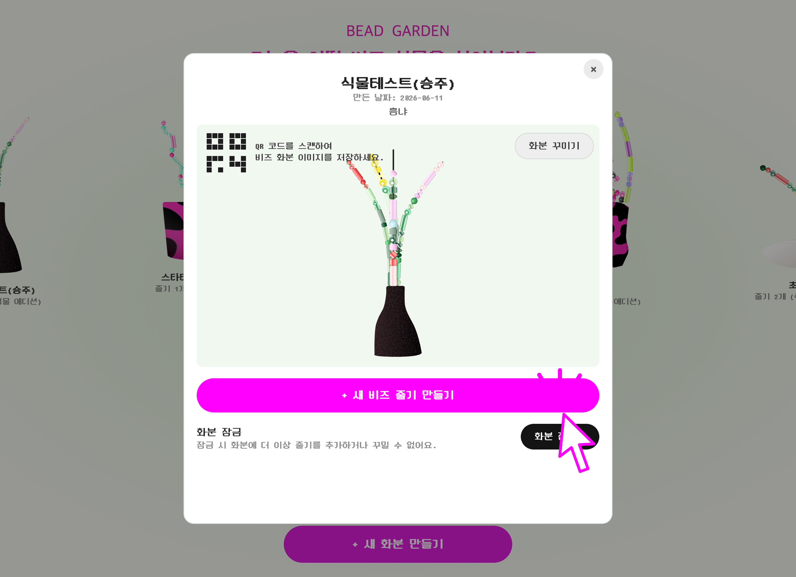
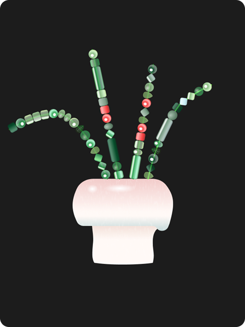
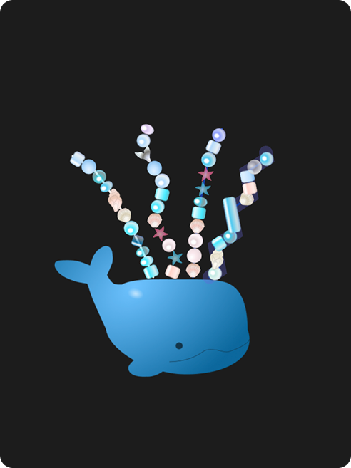
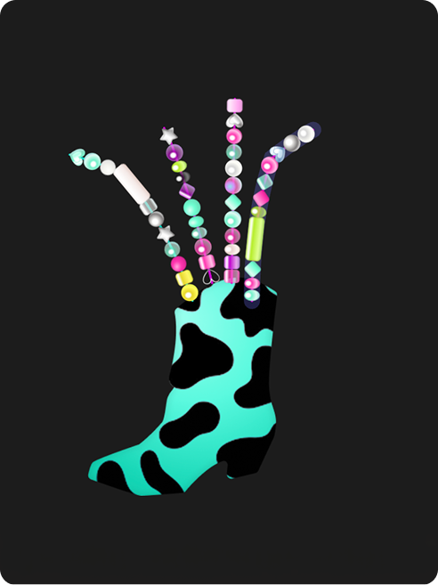

# 🌱 비즈 가든

**2026-1 정보문화기술입문 프로젝트**

비즈 가든은 웹캠 손 인식으로 비즈 줄기를 만들고, 완성한 줄기를 화분에 심어 모두가 함께 감상하는 온라인 비즈 식물 정원입니다.  
배포 페이지는 여기에서 볼 수 있습니다: **https://t99d99t99t99.github.io/BeadGarden/**



## 🌼 프로젝트 소개

비즈 가든은 사용자가 직접 손을 움직여 비즈를 꿰고, 그 결과물을 온라인 정원에 남기는 참여형 웹 게임입니다.  
플레이어는 화분을 만들고, 비즈 줄기를 제작하고, 식물처럼 배치한 뒤 다른 사람들과 결과물을 공유할 수 있습니다.

이 프로젝트는 단순한 꾸미기 도구보다 **손동작 기반 놀이**, **공동 제작**, **온라인 전시**, **디지털 아카이빙**을 함께 실험하는 것을 목표로 합니다. 사용자가 만든 화분은 정원에 남아 다른 사람이 감상하거나, 새 줄기를 덧붙이거나, QR 코드로 공유할 수 있습니다. ✨

## 🔗 바로가기

- 🌐 배포 페이지: https://t99d99t99t99.github.io/BeadGarden/
- 🎮 게임 안 튜토리얼: 정원 화면 또는 인트로에서 확인할 수 있습니다.
- 📷 핵심 인터랙션: 웹캠으로 손을 인식해 비즈 줄기를 제작합니다.

## 🖥️ 플레이 환경

비즈 가든은 브라우저에서 바로 실행되는 웹 게임이지만, 비즈 줄기 제작에는 웹캠과 손 인식 모델이 필요합니다. 코드 기준으로 `ml5.handPose`를 `tfjs` 런타임 우선, `mediapipe` 런타임 폴백으로 로드하고, 웹캠 입력을 30fps로 받아 손의 엄지와 검지 위치를 추적합니다.

### ✅ 필수 조건

- 📷 웹캠이 있는 기기
- 🔐 카메라 권한 허용
- 🌐 안정적인 인터넷 연결
- 🧭 최신 브라우저
- 🎨 HTML5 Canvas, WebRTC 카메라 입력, 최신 JavaScript 문법을 지원하는 환경
- ⚙️ ml5.js와 TensorFlow.js 계열 손 인식 모델을 실행할 수 있는 브라우저 런타임

### 🚀 권장 조건

- 💻 데스크톱 또는 노트북 환경
- 🧭 최신 Chrome 또는 Edge
- ⚡ 하드웨어 가속과 WebGL이 켜져 있는 브라우저
- 🧠 비교적 최근의 CPU/GPU가 있는 기기
- 🖼️ 16:9 화면 비율에 가까운 넓은 화면

### ⚠️ 주의할 점

- 오래된 브라우저나 오래된 운영체제에서는 ml5 손 인식 모델을 불러오지 못할 수 있습니다.
- 특히 오래된 맥 또는 오래된 Safari 환경에서는 ml5와 TensorFlow.js 계열 모델을 가져오거나 초기화하는 단계에서 실패할 수 있습니다.
- 하드웨어 가속 또는 WebGL이 비활성화된 환경에서는 손 인식이 매우 느리거나 실패할 수 있습니다.
- GitHub Pages 배포 페이지는 HTTPS로 제공되므로 카메라 접근이 가능하지만, 로컬에서 실행할 때도 가능한 한 로컬 서버를 통해 여는 것이 좋습니다.
- Firebase 또는 외부 CDN 연결이 막힌 네트워크에서는 데이터 저장, 공유, 폰트, 모델 로딩 일부가 제한될 수 있습니다.
- 카메라 영상은 손 인식 입력으로 사용되며, 프로젝트 코드에서는 카메라 프레임 자체를 Firebase에 저장하는 흐름을 두지 않았습니다.

## ✨ 주요 기능

### 🪴 온라인 비즈 정원

- 여러 사용자가 만든 화분을 한 화면에서 둘러볼 수 있습니다.
- 화분 이름, 줄기 개수, 디자인 테마, 좋아요 수를 확인할 수 있습니다.
- 정원 화면에서 새 화분을 만들거나 기존 화분의 상세 화면으로 들어갈 수 있습니다.

### 📿 손 인식 비즈 줄기 제작

- 웹캠으로 엄지와 검지의 움직임을 추적합니다.
- 화면 속 철사를 집고 움직여 비즈 구멍을 통과시키는 방식으로 줄기를 만듭니다.
- Matter.js 기반 물리 요소와 손 추적 좌표를 결합해 비즈 꿰기 인터랙션을 구성합니다.

### 🎨 화분과 줄기 꾸미기

- 식물, 바다, 별 테마를 선택할 수 있습니다.
- 테마에 맞는 비즈, 화분, 배경 그래픽을 사용합니다.
- 완성된 줄기의 위치와 형태를 조정해 나만의 비즈 식물을 만들 수 있습니다.

| 🌿 식물 테마                                     | 🌊 바다 테마                                     | ⭐ 별 테마                                    |
| ----------------------------------------------- | ----------------------------------------------- | -------------------------------------------- |
|  |  |  |

### 🤝 공동 제작

- 다른 사람이 만든 화분에도 새 줄기를 추가할 수 있습니다.
- 여러 사람의 손길이 쌓이며 하나의 식물이 점점 풍성해지는 구조입니다.
- 화분을 잠그면 이후 수정과 줄기 추가를 제한할 수 있습니다.

### 💾 저장과 공유

- Firebase Firestore와 Storage를 통해 화분 데이터를 저장하고 불러옵니다.
- 화분 상세 화면에서 좋아요, 이미지 다운로드, QR 코드 공유를 제공합니다.
- Firebase 연결이 실패한 경우에도 일부 흐름은 로컬 폴백으로 동작하도록 구성되어 있습니다.

### 🧭 인게임 튜토리얼

- 게임 안에서 전체 흐름을 단계별로 안내합니다.
- 이미지와 영상으로 정원 둘러보기, 화분 만들기, 줄기 제작, 꾸미기, 잠금 기능을 설명합니다.
- 이 문서에서는 조작법을 길게 반복하지 않고, 실제 플레이 안내는 인게임 튜토리얼에 맡깁니다. 🎬

## 🧩 사용자 흐름

1. 🌐 배포 페이지에 접속합니다.
2. 🌱 비즈 가든에서 다른 사용자의 화분을 둘러봅니다.
3. 🪴 새 화분을 만들고 이름과 테마를 정합니다.
4. 📷 웹캠 권한을 허용하고 손 인식으로 비즈 줄기를 제작합니다.
5. 🎨 완성된 줄기를 화분에 배치하고 배경을 꾸밉니다.
6. 💾 저장된 화분을 정원에서 확인합니다.
7. 🔗 QR 코드나 이미지 다운로드로 결과물을 공유합니다.
8. 🔒 필요하면 화분을 잠가 최종 상태를 보존합니다.

## 🗂️ 레포지토리 구조

```text
BeadGarden/
├── index.html              # p5.js 스케치와 전체 스크립트를 불러오는 진입점
├── sketch.js               # 게임 상태 전환, 캔버스 크기, 입력 이벤트 관리
├── style.css               # 페이지와 캔버스 기본 스타일
├── src/                    # 게임 로직과 UI 코드
│   ├── ui/                 # 화면별 UI 클래스
│   ├── objects/            # 비즈, 화분, 철사 오브젝트
│   ├── assets/             # 스프라이트 아틀라스 로딩 코드
│   ├── tools/              # 에셋 빌드와 업로드 보조 도구
│   ├── beadGame.js         # 비즈 줄기 만들기 핵심 로직
│   ├── handDetector.js     # 웹캠 손 인식과 손 좌표 처리
│   ├── db.js               # Firebase 연동과 로컬 폴백
│   └── qrCode.js           # 공유용 QR 코드 생성
├── assets/                 # 런타임 이미지, 영상, 폰트, 사운드
│   ├── backgrounds/        # 화면 및 테마 배경
│   ├── concepts/           # 화분 테마 선택 이미지
│   ├── tutorial/           # 튜토리얼 이미지와 영상
│   ├── ui/                 # 버튼과 UI 그래픽
│   └── atlases/            # 비즈와 화분 스프라이트 시트
├── libraries/              # p5.js, ml5.js, Matter.js 등 브라우저 라이브러리
└── local/                  # 개발 중 참고용 이미지와 문서
```

`src/ui/`는 화면 단위로 나뉘어 있어 인트로, 튜토리얼, 정원 목록, 화분 설정, 화분 꾸미기, 상세 화면, 줄기 제작 화면을 각각 담당합니다.
`assets/`는 실제 플레이 화면에 표시되는 리소스를 모아둔 곳이며, 비즈와 화분 그래픽은 런타임에서 아틀라스 형태로 사용됩니다.

## 🛠️ 기술 스택

- **HTML, CSS, JavaScript**: 전체 웹 게임의 기본 구조입니다.
- **p5.js**: 캔버스 렌더링, 이미지와 영상 표시, 입력 처리, 화면 그리기에 사용합니다.
- **p5.sound**: 배경음과 효과음 처리를 위해 사용합니다.
- **ml5.js**: 웹캠 기반 손 인식 기능에 사용합니다.
- **TensorFlow.js 계열 런타임**: ml5 손 인식 모델 실행에 사용합니다.
- **Matter.js**: 비즈 게임의 물리 움직임과 충돌 처리를 위해 사용합니다.
- **Firebase Firestore**: 화분 데이터와 정원 데이터를 저장하고 불러오는 데 사용합니다.
- **Firebase Storage**: 화분 이미지와 공유용 리소스를 저장하는 데 사용합니다.
- **Firebase Authentication**: 익명 인증을 통해 Firebase 접근을 처리합니다.
- **GitHub Pages**: 배포 페이지 호스팅에 사용합니다.
- **Node.js 개발 도구**: Firebase 관리 스크립트와 에셋 빌드 보조 작업에 사용합니다.

## 🎯 프로젝트 포인트

- 🖐️ 마우스 클릭만이 아니라 손동작을 주요 입력으로 사용합니다.
- 🌿 결과물이 개인 화면에만 남지 않고 온라인 정원에 누적됩니다.
- 🧵 비즈, 철사, 화분이라는 물성 있는 소재를 디지털 인터랙션으로 번역했습니다.
- 🧑‍🤝‍🧑 한 사람이 완성하고 끝내는 구조보다, 여러 사용자가 이어서 가꿀 수 있는 구조를 지향합니다.
- 🖼️ 완성된 식물을 이미지와 QR 코드로 외부에 공유할 수 있습니다.

## 👥 제작

이 프로젝트는 다음 팀원이 함께 제작했습니다.

- 🧭 최민서: 기획 총괄
- 💻 김다현: 비즈 엔진 및 UI 개발
- 🔥 신승주: Firebase 연동 기능 및 UI 개발
- 🎨 손예원: 디자인
- 🎨 이다은: 디자인
